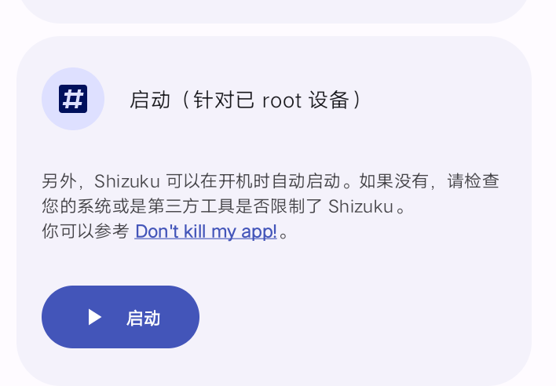
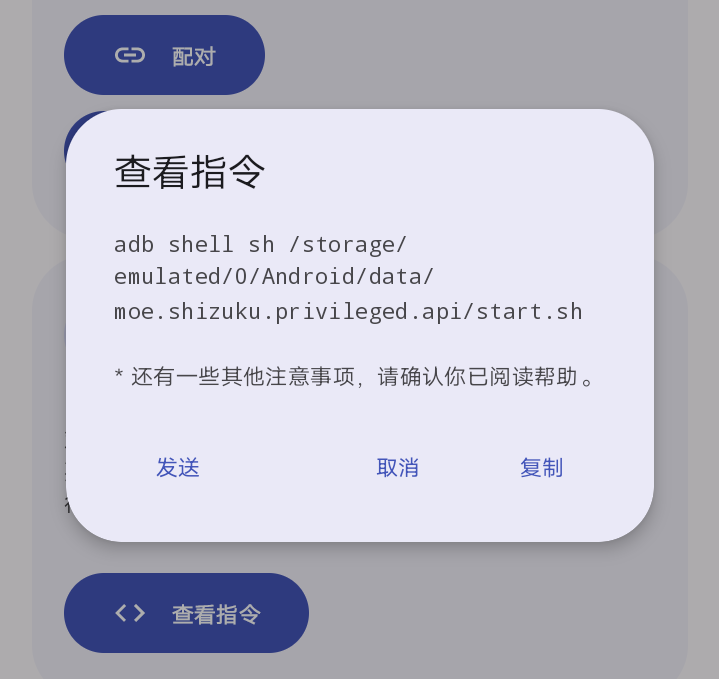
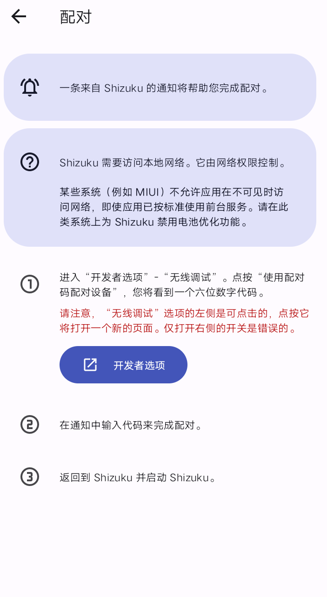

# 无root进行搞机       
> 若您已安装Magisk但不会使用或不会安装请跳转到[Magisk文档](https://chouge1huao.github.io/MagiskDocument/)        
    
大家都知道搞机肯定需要权限然而没有root怎么办呢这里我列出几种能够获取并管理权限的应用      
一. Shizuku 这个想必大多数人都知道它是用来提供adb接口给其他应用使用缺点是每次重启要重新激活有三种激活方式      
1.root这个激活方式就不多提了毕竟是无root         

2.adb通过电脑连接用adb权限执行一个sh进行激活            
          
3.无线调试这种激活方式是无root电脑的首选需要安卓11及以上自带缺点是需要网络但是安卓10及以下其实也可以他会借用usb调试的接口在电脑上执行这样一串adb指令 adb tcpip 5555最后就可以使用无线调试了  

   
二.Dhizuku 这个是仿照Shizuku的提供设备管理员的接口也就是说激活了他你可以给多个应用授权设备管理员目前有两种激活方式(将dhizuku设为设备管理员)
1.shizuku用shizuku授权自动执行命令激活
2.使用shll执行命令

